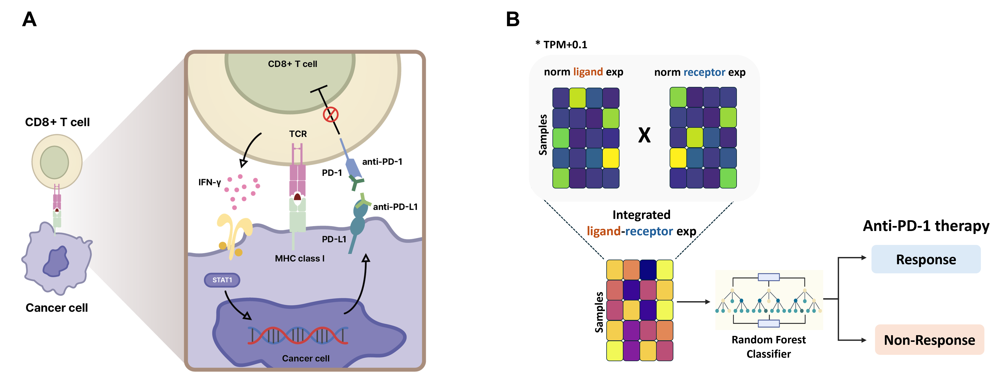

# Expression of ligand-receptor pairs can predict anti-programmed death-1 response in melanoma 
## Motivation
Anti-programmed death-1 (PD-1) therapy has revolutionized melanoma treatment; however, predicting patient response remains challenging. Cell-to-cell communication through ligand-receptor (LR) interactions can fundamentally shape the tumor microenvironment and immune responses. 
## Overview of our study
</img> 
* We developed a predictive model incorporating 2,705 LR pairs across 121 melanoma samples. Using a random forest classifier, our model achieved robust accuracy in the training and test datasets as well as in two independent external validation cohorts.
